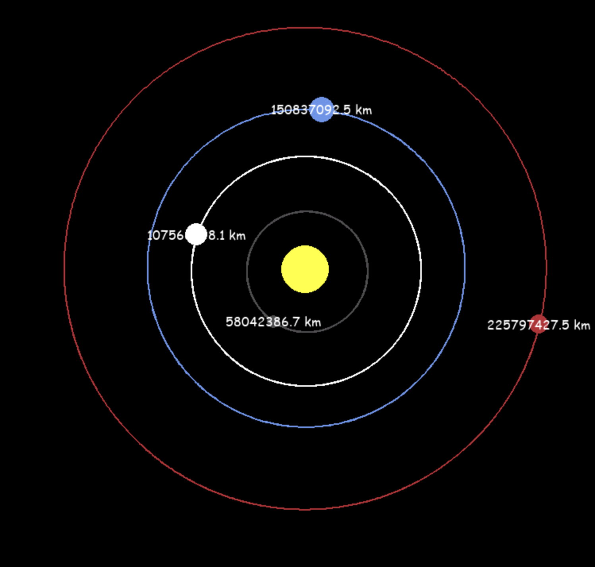

# Planetary Simulation Project

## Description
This project is a simple simulation of the solar system using Pygame. It visualizes the orbits of planets around the Sun, including Earth's Moon orbiting around Earth. The simulation aims to demonstrate basic celestial mechanics within a 2D environment.

## Installation
To run this simulation, you will need Python and Pygame installed on your computer.

### Prerequisites
- Python 3.x
- Pygame

### Installing Pygame
You can install Pygame by running the following command in your terminal or command prompt:

```bash
pip install pygame
```

## Usage
To start the simulation, navigate to the project directory and run the script with Python:

```bash
python planets_simulation.py
```

The simulation window will open, displaying the Sun and several planets. The simulation runs in real-time and can be exited at any time by closing the window.

## Features
- Visualization of the Sun, Earth, Mars, Mercury, Venus, and Earth's Moon.
- Realistic orbital velocities for each celestial body.



## Contributing
Contributions to this project are welcome! Here are a few ways you can help:
- Report bugs and issues.
- Suggest improvements or new features.
- Contribute to the code via pull requests.

## Acknowledgments
- Thanks to the Pygame community for the excellent game development library.
- Inspired by real-world physics and the beauty of the solar system.
